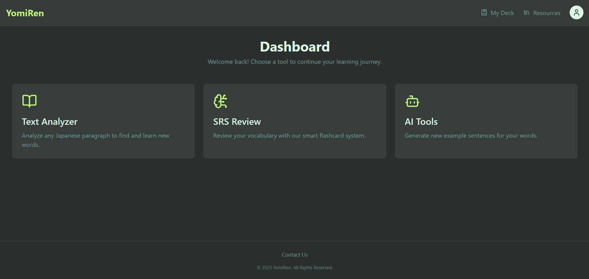
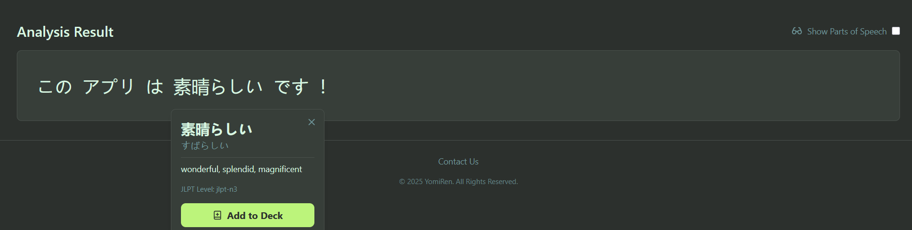
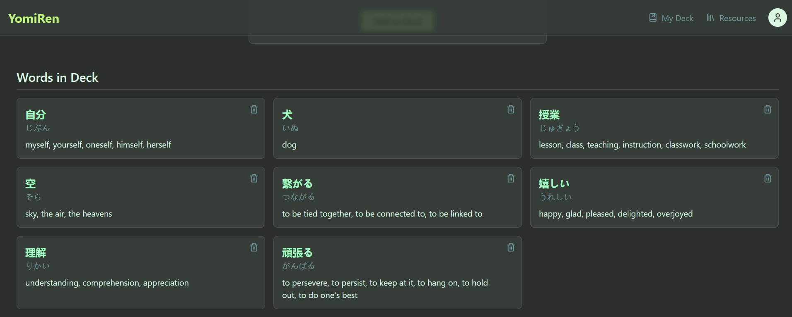

# YomiRen - Japanese Reading & Vocabulary Platform

**An intelligent, full-stack MERN application designed to help Japanese language learners turn passive immersion into an active, organized, and effective learning experience.**

---

###  Screenshots

Here are a few glimpses of YomiRen in action. The application features a clean, custom-themed, and fully responsive dark-mode UI built with Tailwind CSS.

| Dashboard | Text Analyzer (Interactive) | My Deck (Vocabulary Manager) |
| :---: | :---: | :---: |
|  |  |  |

---

### About The Project

As a Japanese language learner myself, I found that while immersion is the best way to learn, it can be disorganized. It's difficult to track new words you encounter in articles or stories and even harder to review them effectively. Generic flashcard apps are great, but they are disconnected from the context of the media you consume.

I built **YomiRen** to solve this problem. It's a "smart reading companion" that bridges the gap between reading and learning. It allows users to analyze any Japanese text, instantly look up unknown words, add them to a personal vocabulary deck, and review them with a built-in Spaced Repetition System (SRS).

---

### Core Features

* **Secure User Authentication**: Full user registration and login system using JWT for secure, persistent sessions.
* **Interactive Text Analyzer**: Users can paste any Japanese text to generate an interactive lesson. The app uses a Natural Language Processing (NLP) library (`kuromoji.js`) to tokenize the text.
* **"Yomitan-Style" Popup Dictionary**: Clicking any word in the analyzed text makes an API call to a dictionary service (Jisho.org) and displays a clean "placard" with the word's definition, reading, and JLPT level.
* **Smart Vocabulary Deck**: Users can add words from the analyzer to their personal deck with a single click. The "Add Word" form is powered by the same smart dictionary lookup to auto-fill details.
* **Spaced Repetition System (SRS)**: A custom-built review system that intelligently schedules flashcard reviews based on the user's performance, enhancing long-term memory retention.
* **AI Sentence Generator**: An integrated AI feature (powered by the Google Gemini API) that can generate new, level-appropriate example sentences for any word in the user's deck.

---

### Tech Stack & Architecture

This project is a full-stack MERN application built with a professional, scalable architecture.

* **Frontend**:
    * **React** (with Vite)
    * **Redux Toolkit** (for global state management)
    * **React Router** (for client-side routing)
    * **Tailwind CSS** (for a custom, responsive design system)
    * **Axios** (for API communication)

* **Backend**:
    * **Node.js** & **Express.js**
    * **JWT (JSON Web Tokens)** for authentication
    * **bcrypt.js** for password hashing
    * **CORS** & **`dotenv`** for security and configuration

* **Database**:
    * **MongoDB** (with Atlas for cloud hosting)
    * **Mongoose** (for object data modeling and validation)

* **Third-Party Services & Libraries**:
    * **Google Gemini API**: For the AI Sentence Generator.
    * **`kuromoji.js`**: The Natural Language Processing library for Japanese tokenization.
    * **Jisho.org API**: The source for our dictionary lookups.

---

### Local Setup & Installation

To run this project locally, follow these steps:

1.  **Clone the repository:**
    ```bash
    git clone [https://github.com/your-username/YomiRen-MERN-App.git](https://github.com/your-username/YomiRen-MERN-App.git)
    cd YomiRen-MERN-App
    ```

2.  **Setup Backend:**
    * Navigate to the backend folder: `cd backend`
    * Install dependencies: `npm install`
    * Create a `.env` file in the `backend` root and add the following variables:
        ```
        PORT=5000
        MONGO_URI=your_mongodb_connection_string
        JWT_SECRET=your_super_secret_jwt_key
        GEMINI_API_KEY=your_google_gemini_api_key
        ```
    * Start the backend server: `npm run dev`

3.  **Setup Frontend:**
    * Open a new terminal and navigate to the frontend folder: `cd frontend`
    * Install dependencies: `npm install`
    * Start the frontend development server: `npm run dev`

The application will be available at `http://localhost:5173`.
